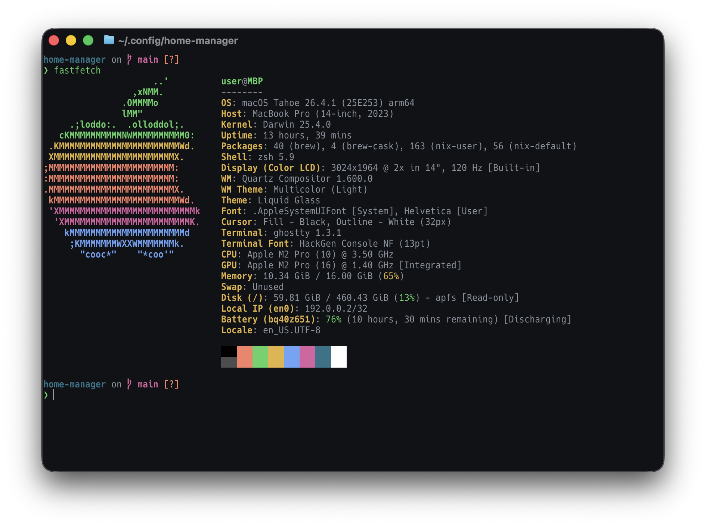

# ❄️ macOS Nix Dotfiles


## Showcase


## Stack

| Category | Tool | Description |
| :--- | :--- | :--- |
| **OS** | macOS | Host Operating System |
| **Package/Env** | Nix + Home Manager | Flakes enabled, declarative management |
| **Terminal** | Ghostty | GPU-accelerated, Catppuccin Mocha theme |
| **Shell** | Zsh + Starship | Fast, contextual prompt |
| **Editor** | Helix | Modal editor configured for C++/Rust/Nix |
| **Workspace** | direnv + nix-direnv | Per-directory environment switching |

## Architecture
```text
.
├── flake.nix          # エントリポイント (Inputs / Outputs)
├── flake.lock         # 依存バージョンのスナップショット
├── home.nix           # ベース設定・モジュールの読み込み
└── modules/           # 機能ごとの設定群
    ├── ghostty.nix    # ターミナルエミュレータ
    ├── helix.nix      # エディタ・LSP設定
    └── zsh.nix        # シェル・エイリアス・プロンプト
```

## Bootstrapping

### 1. Nix 導入
[Determinate Systems](https://determinate.systems/nix) 使用
```bash
curl --proto '=https' --tlsv1.2 -sSf -L https://install.determinate.systems/nix | sh -s -- install
```

### 2. リポジトリのクローン
設定ファイルを Home Manager のデフォルトパスに配置
```bash
git clone https://github.com/s4chiko/nix-dotfiles.git ~/.config/home-manager
cd ~/.config/home-manager
```

### 3. Home Manager の適用 (Activation)
```bash
nix run home-manager/master -- switch --flake .#user